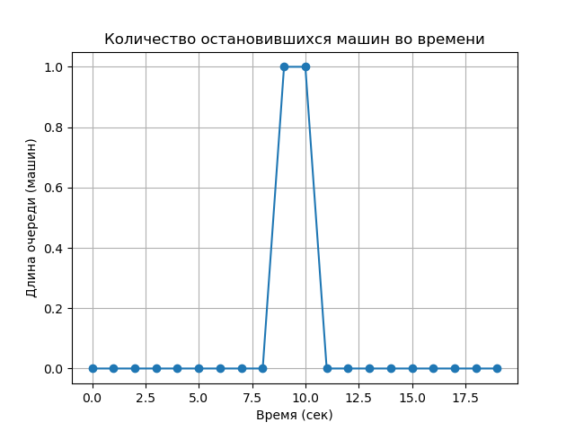
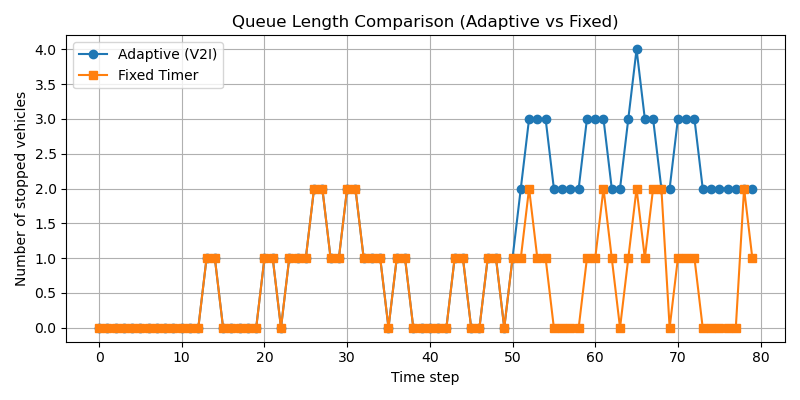

# 🚦 V2X Traffic Light Simulation
> Python-проект по симуляции адаптивного светофора на основе V2I-коммуникации


Симуляция взаимодействия транспортных средств и светофора по технологии V2I (Vehicle-to-Infrastructure).

## 📌 Описание

Проект моделирует адаптивный светофор, который принимает решения на основе данных, полученных от приближающихся машин (V2I-коммуникация).

Цель — продемонстрировать, как "умный" светофор может динамически изменять фазы сигнала, чтобы снизить длину очереди и время ожидания.

---

## 🧱 Архитектура

- **Vehicle** — объект машины, который движется и отправляет данные светофору.
- **TrafficLight** — объект светофора, который анализирует данные и регулирует фазы.
- **Simulation** — главный скрипт, который объединяет всё, логирует события и строит графики.

---

## 📈 Результаты

### Лог

Во время симуляции ведётся лог:

data/traffic_log.csv


### График

После завершения симуляции строится график очереди:



---

## 🧠 Используемые технологии

- Python 3.10+
- Matplotlib
- CSV для логирования

---

---

## 📈 Сравнение режимов работы

Сравнение очередей между обычным и адаптивным светофором:



---

## 🎥 Анимация симуляции


---

## 🧭 Схема V2X-взаимодействия

Диаграмма архитектуры V2I-коммуникации:


---

## 🧠 Заключение

Проект демонстрирует простую, но эффективную V2I-модель адаптивного светофора, реализованную на Python. Даже базовая симуляция уже позволяет увидеть разницу между "глупой" и "умной" транспортной системой.

---

📄 [Техническое описание (PDF)](docs/technical_description.pdf)


## ⚙️ Запуск

```bash
python animated_simulation.py


## 📎 Контакты

По вопросам: asdobershteyjn@gmail.com / GitHub aaashteyjn / Telegram @user896745]

---
