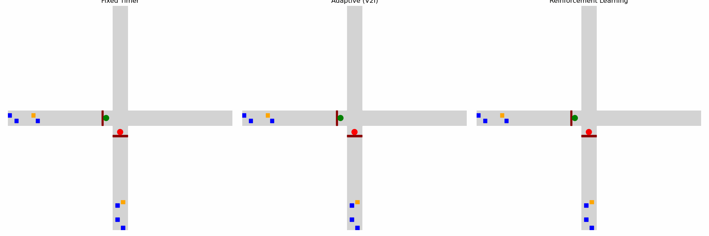
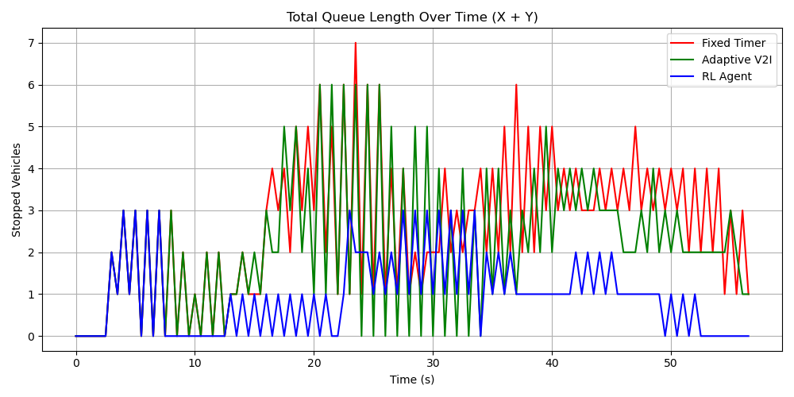
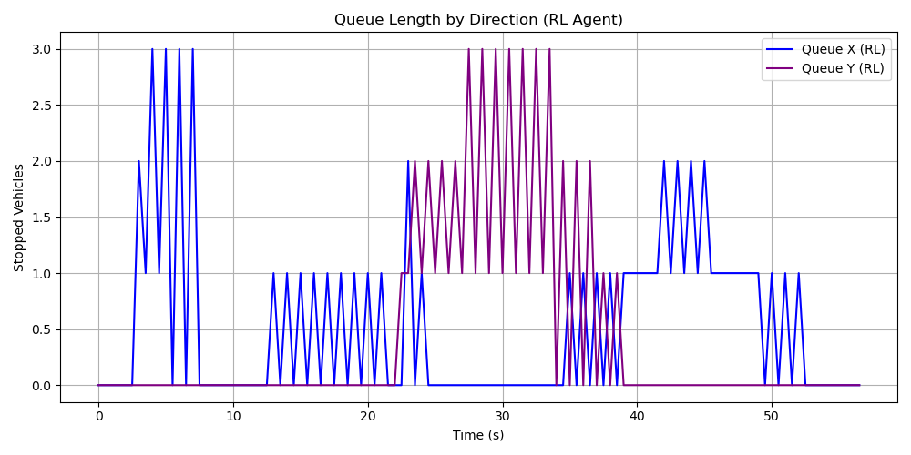
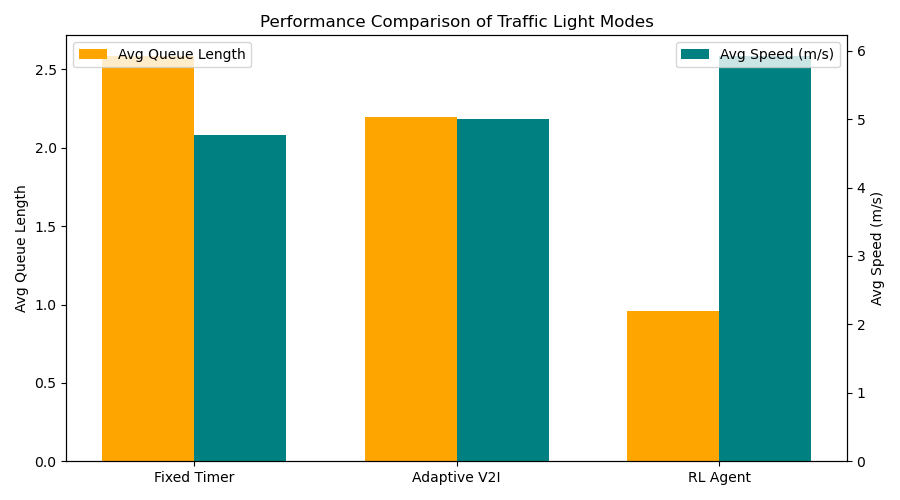

# V2X Traffic Light Simulation

This project demonstrates a simulation of an adaptive traffic light system with Vehicle-to-Infrastructure (V2I) communication and a reinforcement learning (RL) agent for traffic control. The goal is to analyze and compare three traffic light modes:

- **Fixed Timer** — standard pre-defined cycle
- **Adaptive (V2I)** — responds to traffic density via vehicle communication
- **Reinforcement Learning Agent** — trained with PPO to minimize queues and delays

---

## Features

- Intersection with two perpendicular roads and multiple lanes
- Vehicles with randomized length, speed, and reaction delay
- *Troublemaker vehicle* that occasionally brakes unexpectedly
- Stop lines and visual traffic lights in the center of the intersection
- Three control modes: *Fixed*, *Adaptive*, *RL Agent*
- Animated visualization with visible roads, square vehicles, and light states
- Detailed logs saved in CSV for further analysis
- Performance evaluation with Python data analysis

---

## Architecture

- **Vehicle** — simulates movement, speed, braking, and V2I communication  
- **TrafficLight** — manages states (`green_x`, `green_y`, `yellow`) and evaluates queues  
- **IntersectionEnv** — Gymnasium-based RL environment for agent training  
- **Simulation scripts** — run and visualize the modes  
- **Analyzer** — computes metrics and generates comparative plots

---

## Project Structure

```
v2x_traffic_light_sim/
├──  vehicle.py # Vehicle behavior
├── traffic_light.py # Traffic light logic
├── intersection_env.py # RL environment
├── animated_compare.py # Main visualization
├── analyze_log.py # Performance analysis
├── train_rl.py # RL agent training
├── data/ # Simulation logs
├── visuals/ # Plots and animations
├── README.md
├── technical_description.md
├── requirements.txt
├── .gitignore
└── archive/ # Old scripts and prototypes
```

---

## Results

### Logging

During each simulation, detailed logs are recorded in the `data/` directory:

- `traffic_log_fixed.csv` — Fixed Timer mode
- `traffic_log_adaptive.csv` — Adaptive (V2I) mode
- `traffic_log_rl.csv` — Reinforcement Learning mode

Each entry contains:  
`time, vehicle_id, direction, position_x, position_y, speed, stopped, troublemaker, light_state`

These logs provide the basis for performance analysis, including queue lengths, average speeds, and crash detection.

---

### Visual Outputs

- `queue_total_comparison.png` — Total queue length over time (all modes)  
- `queue_rl_by_direction.png` — Queue lengths in RL mode by direction  
- `performance_comparison_intersection.png` — Bar chart of average queue length and speed  
- Live **animated simulation** (`animated_compare.py`) with visible roads, vehicles, and traffic lights  

---

## Simulation Preview

### Side-by-Side Simulation
The following animation shows traffic flow under three control modes (Fixed Timer, Adaptive V2I, RL Agent):



---

## Performance Highlights

- **Adaptive V2I** reduced average queue length by ~40% compared to Fixed Timer.  
- **RL Agent** shows learning capability, though additional training is needed for consistent superiority.  
- **Queue analysis** demonstrates smoother traffic flow and reduced congestion under Adaptive and RL modes.  
- **Troublemaker vehicle** introduces realistic stochastic disruptions, highlighting system robustness.  

---

## Key Figures

- **Total Queue Length Over Time**  
  

- **Queue by Direction (RL Agent)**  
  

- **Performance Comparison**  
  

---

## Installation

```bash
git clone https://github.com/your-username/V2X_Traffic_Light_Sim.git
cd V2X_Traffic_Light_Sim
pip install -r requirements.txt
```

## Run the animated imulation

```bash
python animated_compare.py
```

**Train the RL-agent**

```bash
python train_rl.py
```

**Analyze logs and generate performance plot**

```bash
python analyze_log.py
```

---

## Parameter Justification

| Parameter                  | Value                   | Rationale                                                       |
| -------------------------- | ----------------------- | --------------------------------------------------------------- |
| Number of vehicles         | 8                       | Provides enough density to realistically form queues            |
| Traffic light position     | 0 m (vehicles start up to -100 m) | Intersection reference point; vehicles are generated up to 100 m before the stop line |
| Stop threshold             | 5 m                     | Reflects typical braking distance at urban speeds               |
| Reaction delay             | 0.3–0.8 s               | Models human driver reaction times (empirical average ~0.7 s)   |
| Troublemaker probability   | 1 per simulation        | Introduces stochastic behavior to mimic unpredictable drivers   |
| Adaptive trigger condition | ≥3 vehicles within 30 m | Threshold for detecting significant traffic clusters            |

---

## Technologies

- Python 3.10+
- Matplotlib for visualization
- Pandas & NumPy for analysis
- Gymnasium for RL environment
- Stable-Baselines3 (PPO) for training RL agent
- PyTorch backend

---

## Conclusion

This project demonstrates how combining V2I communication and reinforcement learning can significantly improve traffic flow efficiency at intersections. Even in a simplified setting, the results highlight the advantages of adaptive and learning-based traffic light systems over traditional fixed timers.

---

## Future Work

The current simulation provides a simplified yet illustrative model of V2X-based traffic light control. Future improvements may include:

- **Multi-lane intersections** — introducing additional lanes with overtaking and lane changes.
- **Multiple intersections** — simulating network-wide coordination between traffic lights.
- **Priority vehicles** — modeling buses, trams, and emergency services with higher priority.
- **Weather and environmental conditions** — factoring in visibility and road surface changes.
- **Advanced RL algorithms** — e.g., DQN, A3C, or hybrid models for better adaptability.
- **Scalability tests** — evaluating performance under heavy traffic scenarios.
- **Integration with real-world data** — using open traffic datasets for training and validation.

## Technical description (md)

[Technical description (Markdown)](docs/technical_description.md)

---

## Author

Student lab-project,
V2X-based control using Python
Alina Dobershteyjn, 2025

## Contacts

For questions: [adobershteyjn@gmail.com / GitHub aaashteyjn / Telegram @user896745]
