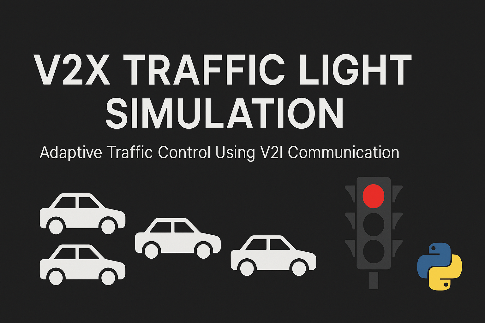

# 🚦 V2X Traffic Light Simulation
**Adaptive Traffic Control Using V2I Communication**
> This project demonstrates a Python-based simulation of adaptive traffic light control using V2X (Vehicle-to-Infrastructure) communication. The system reacts dynamically to real-time traffic conditions based on data received from approaching vehicles.

---

## 📌 Project Description

The simulation models a simple scenario where vehicles move along a straight road toward a traffic light. Vehicles communicate their position and speed to the infrastructure (V2I), and the traffic light uses this data to decide when to change its signal.

Two modes of operation are supported:
- **Adaptive Mode** – the light reacts to the density of vehicles approaching.
- **Fixed-Timer Mode** – the light follows a predefined timer schedule regardless of traffic.

---

## 🧱 Architecture

- **Vehicle** — the object representing a car that moves and sends data to the traffic light.  
- **TrafficLight** — the object that analyzes incoming data and controls the light phase.  
- **Simulation** — the main script that brings everything together, logs data, and generates graphs.

---

## 🧠 Key Concepts

- **V2X Communication**  
- **Traffic Simulation in Python**  
- **Data-Driven Decision Making**  
- **Comparative Visualization (adaptive vs fixed)**

---

## 📂 Project Structure

```
v2x_traffic_light_sim/
├── vehicle.py # Vehicle class
├── traffic_light.py # TrafficLight class
├── simulation.py # Basic logic without animation
├── animated_simulation.py # Visual animation (matplotlib)
├── compare_simulation.py # Comparison of adaptive vs fixed
├── data/
│ └── traffic_log.csv # Log of vehicle states
├── visuals/
│ ├── traffic_animation.gif # Animated movement
│ ├── queue_plot.png # Queue length over time
│ ├── queue_comparison.png # Comparison of two modes
│ └── banner.png # GitHub banner
├── README.md
├── requirements.txt
├── .gitignore
```

---

## 📈 Results

### 🔹 Logging

During the simulation, all vehicle states and light changes are recorded in:

data/traffic_log.csv

This log is used to analyze queue length and behavior over time.

### 🔹 Visual Outputs

- `queue_plot.png` – Queue length in adaptive mode  
- `queue_comparison.png` – Fixed vs Adaptive comparison  
- `traffic_animation.gif` – Vehicle movement animation  

---

## 🚗 Simulation Preview

### ▶️ Adaptive Mode Animation


### 📈 Queue Length Comparison


---

## ⚙️ Installation

```bash
pip install -r requirements.txt
```

## 🚀 Run the Simulation
**Basic (no animation):**

```bash
python simulation.py
```

**Animated version**

```bash
python animated_simulation.py
```

**Compare adaptive vs fixed**

```bash
python compare_simulation.py
```

---

## 🔍 Parameter Justification

| Parameter                  | Value                       | Reasoning                                                    |
| -------------------------- | --------------------------- | ------------------------------------------------------------ |
| **Number of vehicles**     | `5`                         | Allows observable traffic formation in a simple 1-lane setup |
| **Traffic light position** | `100 m`                     | Easy reference point for movement, graphs, and V2I zone      |
| **Stop threshold**         | `5 m`                       | Realistic braking distance near traffic light                |
| **Adaptive decision zone** | ≥`3` vehicles within `30 m` | Models a local traffic cluster requiring delayed red phase   |

---

## 🧠 Technologies Used

- Python 3.10+
- Matplotlib – for graphs and animations
- CSV – for simulation logging and data tracking

---

## 🧠 Conclusion
This project demonstrates a simple but effective implementation of a V2I adaptive traffic light model using Python. Even this basic simulation reveals the contrast between a conventional fixed-timer system and an intelligent traffic system that dynamically responds to real-time vehicle data.

---

## 📄 Technical Report (PDF)

[Technical description (Markdown)](docs/technical_description.md)

---

## ✨ Author

Student lab-project,
V2X-based control using Python
Alina Dobershteyjn, 2025

## 📎 Contacts

For questions: [adobershteyjn@gmail.com / GitHub aaashteyjn / Telegram @user896745]
