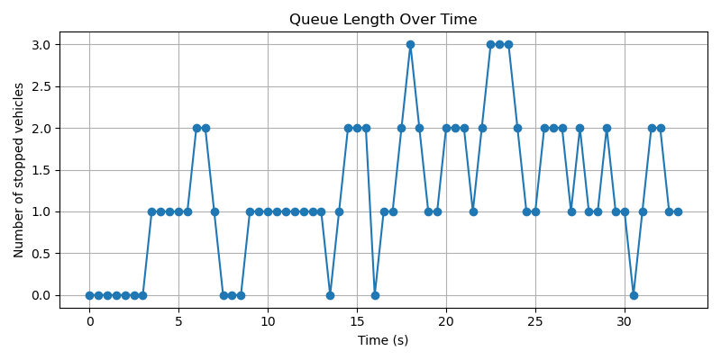
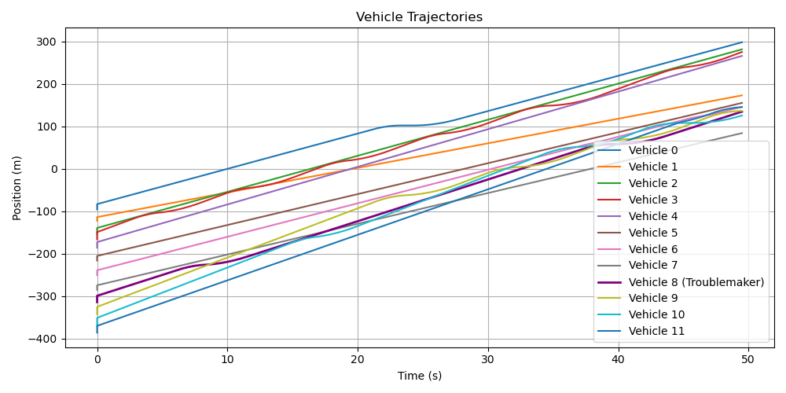
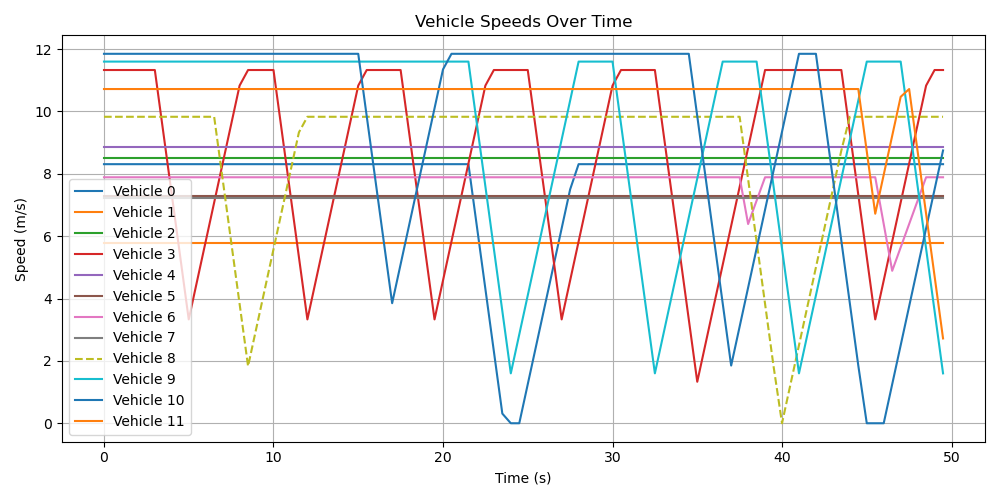

# 🚦 V2X Traffic Light Simulation
**Adaptive Traffic Control Using V2I Communication**

This project simulates adaptive traffic light control using V2X (Vehicle-to-Infrastructure) communication.  
The system dynamically reacts to real-time traffic conditions, reducing waiting times and improving flow efficiency. 

---

## 📌 Project Description

The simulation models a simple scenario where vehicles move along a straight road toward a traffic light. Vehicles communicate their position and speed to the infrastructure (V2I), and the traffic light uses this data to decide when to change its signal.

Two modes of operation are supported:
- **Adaptive Mode** – the light reacts to the density of vehicles approaching.
- **Fixed-Timer Mode** – the light follows a predefined timer schedule regardless of traffic.

---

## 🧱 Architecture

- **Vehicle** — represents a car or truck, moves with acceleration/deceleration, reacts with delay, and may exhibit unpredictable behavior (troublemaker).  
- **TrafficLight** — controls signal phases based on fixed timer or V2I adaptive logic.  
- **Simulation** — integrates all components, logs events, produces visualizations and analytics.  
- **Analysis** — processes simulation logs to produce queue length, trajectories, and speed graphs.  


---

## 📌 Features

- Random vehicle generation (positions, speeds, types).  
- Vehicle classes: **cars** (faster, shorter) and **trucks** (slower, longer).  
- **Reaction delays** to simulate driver behavior.  
- **Unpredictable driver** (troublemaker) that may brake suddenly.  
- Adaptive vs fixed traffic light modes.  
- Detailed CSV logging of events.  
- Automated analysis with advanced graphs.  

---

## 📂 Project Structure

```
v2x_traffic_light_sim/
├── vehicle.py # Vehicle class (with delays & troublemaker)
├── traffic_light.py # Traffic light logic (adaptive/fixed)
├── simulation.py # Core simulation (text mode)
├── animated_simulation.py # Animated visualization
├── animated_compare.py # Side-by-side fixed vs adaptive
├── compare_simulation.py # Queue length comparison
├── analyze_log.py # Post-simulation analytics
├── data/
│ └── traffic_log.csv # Vehicle log (generated)
├── visuals/
│ ├── traffic_animation.gif
│ ├── compare_animation.gif
│ ├── queue_comparison.png
│ ├── queue_length.png
│ ├── trajectories.png
│ ├── speeds.png
│ ├── v2x_diagram.png
│ └── banner.png
├── README.md
├── technical_description.md
├── requirements.txt
└── .gitignore
```

---

## 📈 Results

### 🔹 Logging

During the simulation, all vehicle states and light changes are recorded in:

data/traffic_log.csv

This log is used to analyze queue length and behavior over time.

### 🔹 Visual Outputs

- `queue_plot.png` – Queue length in adaptive mode  
- `queue_comparison.png` – Fixed vs Adaptive comparison  
- `traffic_animation.gif` – Vehicle movement animation  

---

## 🚗 Simulation Preview

### ▶️ Adaptive Mode Animation


### 📈 Queue Length Comparison


---

## 📈 Advanced Results

### Queue Length Over Time


### Vehicle Trajectories


### Vehicle Speeds


**Observations:**
- Adaptive traffic light reduces average queue length vs fixed mode.
- Sudden braking by the troublemaker propagates to following vehicles.
- Speed profiles show smooth deceleration/acceleration instead of instant stops.

---

## ⚙️ Installation

```bash
pip install -r requirements.txt
```

## 🚀 Run the Simulation
**Basic (no animation):**

```bash
python simulation.py
```

**Animated version**

```bash
python animated_simulation.py
```

**Compare adaptive vs fixed**

```bash
python compare_simulation.py
```

**Side-by-side comparison**

```bash
python animated_compare.py
```

**Analyze logs**

```bash
python analyze_log.py
```

---

## 🔍 Parameter Justification

| Parameter                  | Value                   | Purpose                      |
| -------------------------- | ----------------------- | ---------------------------- |
| Number of vehicles         | 8                       | Sufficient to form a queue   |
| Traffic light position     | 100 m                   | Intersection reference point |
| Stop threshold             | 5 m                     | Realistic braking distance   |
| Reaction delay             | 0.5–1.5 sec             | Driver behavior simulation   |
| Troublemaker probability   | 1 per simulation        | Models unpredictable driver  |
| Adaptive trigger condition | ≥3 vehicles within 30 m | Detects traffic clusters     |

---

## 🧠 Technologies Used

- Python 3.10+
- Matplotlib – for graphs and animations
- CSV – for simulation logging and data tracking

---

## 🧠 Conclusion
This simulation demonstrates a more realistic V2I adaptive traffic light system with:

- mixed vehicle types,

- driver delays,

- unpredictable behaviors,

- adaptive vs fixed mode comparison,

- advanced analytics via logged data.

It highlights how adaptive V2X communication can significantly improve intersection efficiency, reduce queue lengths, and handle non-ideal driver behaviors.

---

## 📄 Technical Report (md)

[Technical description (Markdown)](docs/technical_description.md)

---

## ✨ Author

Student lab-project,
V2X-based control using Python
Alina Dobershteyjn, 2025

## 📎 Contacts

For questions: [adobershteyjn@gmail.com / GitHub aaashteyjn / Telegram @user896745]
