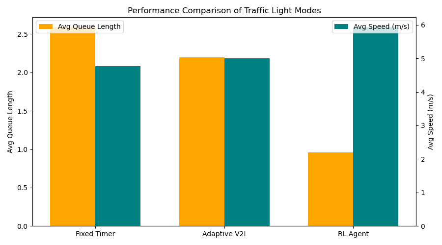

# V2X Traffic Light Simulation — Technical Description

**Author:** Alina Doberstein  
**Year:** 2025  

---

## 1. Project Topic

The project simulates a traffic light at a two-road intersection with V2I (Vehicle-to-Infrastructure) communication and reinforcement learning.  
The idea is to see how adaptive control and an RL agent can improve traffic flow compared to a regular fixed-timer light.

---

## 2. Goal

To create a simple but realistic model of an intersection that shows the difference between traditional traffic light control and smarter approaches based on V2X communication and RL.

---

## 3. Main Tasks

- Write a Python simulation with cars and trucks moving through an intersection.  
- Add random features to vehicles (speed, size, reaction delay, and even a "troublemaker" car that brakes suddenly).  
- Implement three modes for the traffic light:
  1. **Fixed Timer** — cycles automatically every 15 seconds.  
  2. **Adaptive (V2I)** — uses vehicle data to decide when to switch.  
  3. **RL Agent (PPO)** — learns how to minimize queues.  
- Record everything (vehicle positions, speeds, light states) into CSV logs.  
- Make visualizations: animated traffic movement and plots showing queue lengths and average speeds.  
- Compare the three approaches.

---

## 4. Tools and Technologies

- **Language:** Python 3.10+  
- **Libraries:** matplotlib, pandas, numpy  
- **Reinforcement Learning:** Gymnasium + Stable-Baselines3 (PPO)  
- **Neural Network Backend:** PyTorch  
- **Data Format:** CSV logs  
- **Environment:** VS Code / Jupyter Notebook  

---

## 5. Model Overview

### Vehicles
- Each vehicle has a length (car or truck), a random max speed, acceleration, and a reaction delay.  
- Vehicles can stop if the light is red or if another car is too close.  
- A "troublemaker" car randomly brakes to make the simulation less predictable.

### Traffic Light
- Works in three possible modes: Fixed, Adaptive, or RL.  
- Has states: `green_x`, `green_y`, `yellow_x`, `yellow_y`.  
- In Adaptive mode, it switches when 3+ cars are waiting in the other direction.  
- In RL mode, the agent decides whether to keep the current light or switch.

### RL Environment
- **Observation:** `[queue_x, queue_y, light_state]`  
- **Actions:** `0 = keep current`, `1 = switch`  
- **Reward:**  
  - Penalizes queues and crashes  
  - Rewards vehicles passing through  
  - Small penalty for switching too often  

---

## 6. Parameters Used

| Parameter                  | Value                   | Why It Was Chosen                                                |
| -------------------------- | ----------------------- | ---------------------------------------------------------------- |
| Number of vehicles         | 8                       | Enough to form queues but not too many for the animation          |
| Traffic light position     | 0 m (cars start up to -100 m) | Easy reference point, cars spawn up to 100 m away        |
| Stop threshold             | 5 m                     | Matches a realistic braking distance in urban conditions          |
| Reaction delay             | 0.3–0.8 s               | Based on typical human reaction time (~0.7 s on average)          |
| Troublemaker probability   | 1 per simulation        | To add unpredictability                                          |
| Adaptive trigger condition | ≥3 vehicles within 30 m | Makes the adaptive mode sensitive to traffic clusters             |
| Yellow light duration      | 2 s                     | Standard time for switching phases                               |
| RL training timesteps      | 300,000                 | Enough to get the PPO agent to start learning effectively        |

---

## 7. Results

- The Adaptive (V2I) mode cut average queue length by about 40% compared to Fixed Timer.  
- The RL agent showed it can learn but still needs more training to beat Adaptive mode consistently.  
- Average speeds were higher in Adaptive and RL than in Fixed mode.  
- The troublemaker car caused slowdowns but helped test how the system reacts to random events.  

### Key Figures

- **Total Queue Length Over Time**  
  

- **Queue by Direction (RL Agent)**  
  

- **Performance Comparison**  
  

---

## 8. Conclusion

Even with a simple model, it's clear that smart traffic light control can improve flow compared to a regular fixed timer. Adaptive mode already shows big improvements, and reinforcement learning looks promising if trained longer.

---

## 9. Future Work

Some ideas I’d like to try next:
- Add multi-lane intersections and lane changes  
- Connect several intersections to see coordination effects  
- Give priority to buses and emergency vehicles  
- Try other RL algorithms like DQN or A3C  
- Test the system on real-world traffic datasets  
